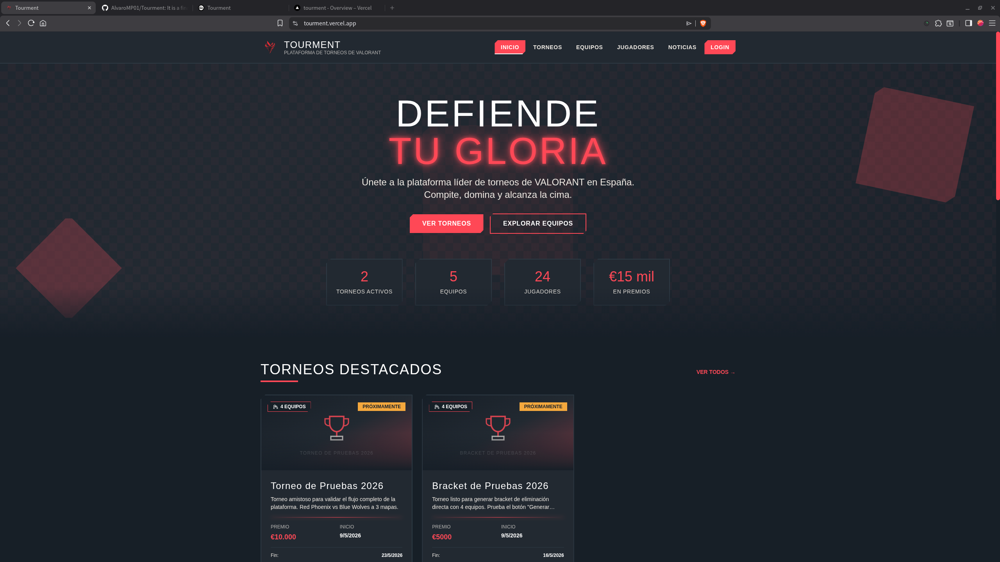
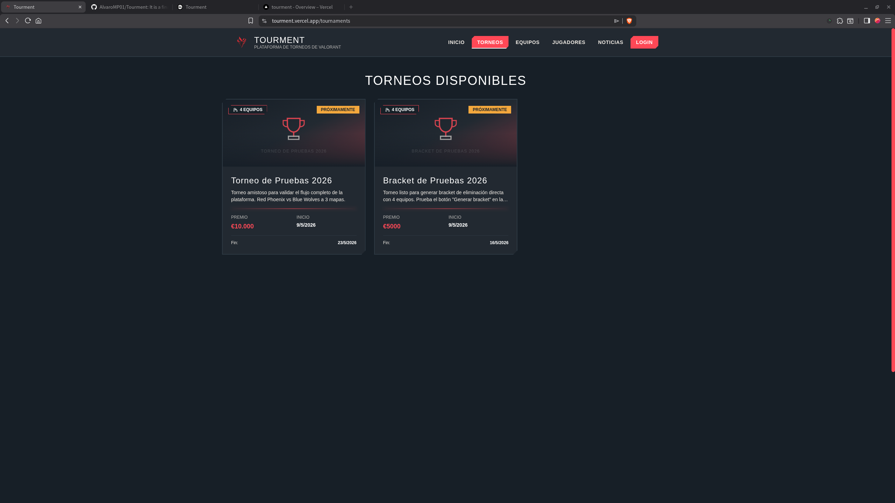
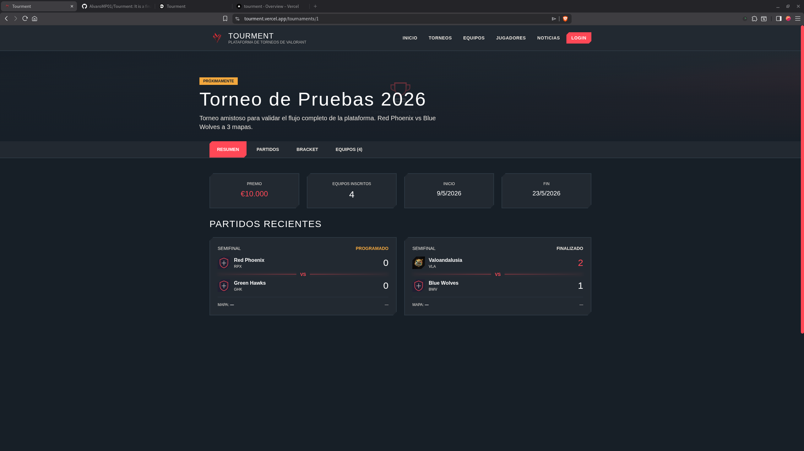
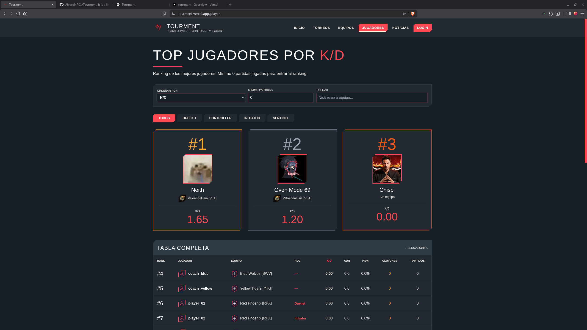
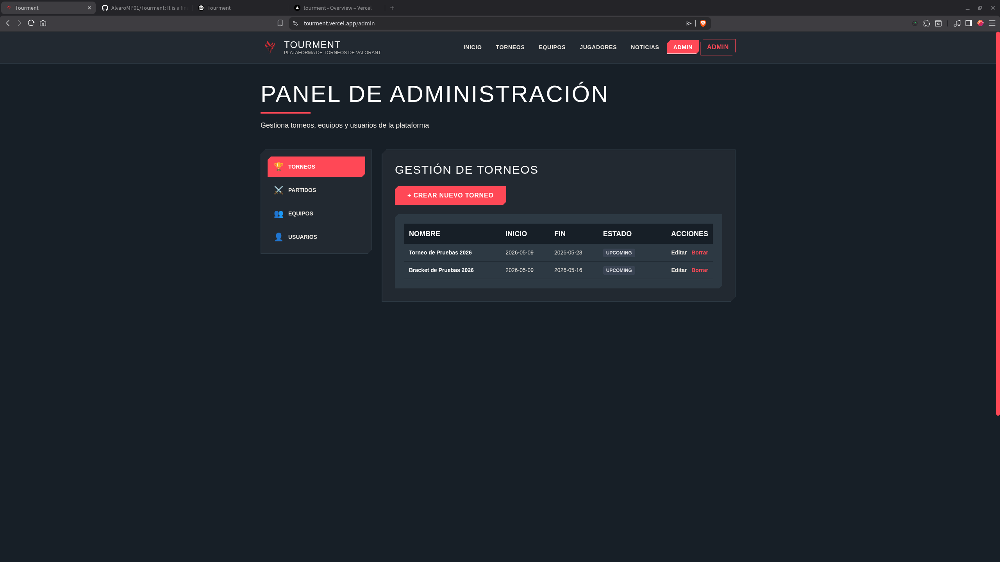
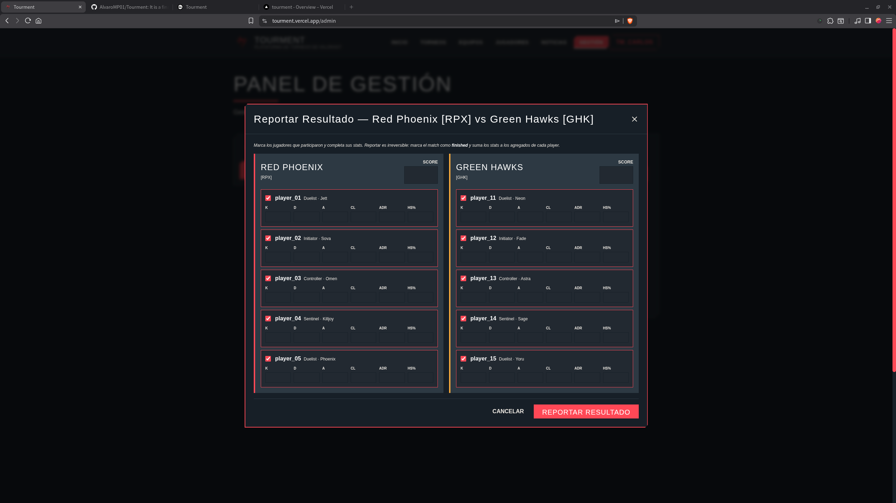
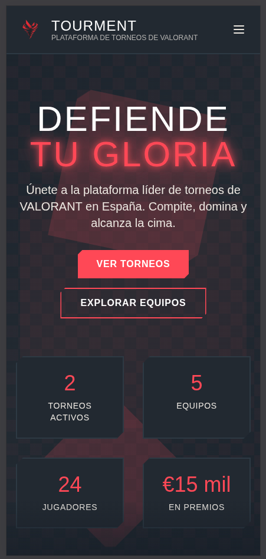
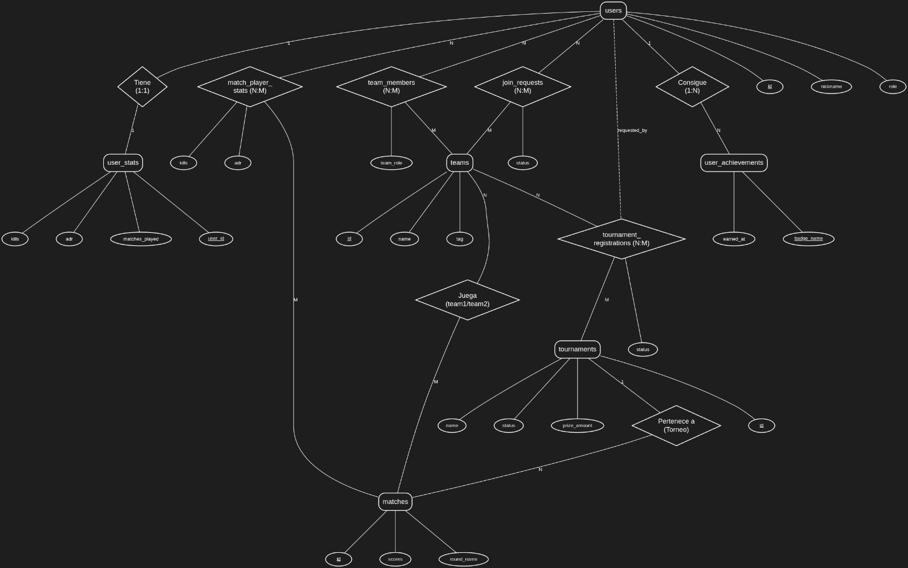

# Tourment — Plataforma de Gestión de Torneos de VALORANT

Aplicación web full-stack para la organización y seguimiento de torneos amateurs de VALORANT en España. Centraliza la gestión de equipos, inscripciones, partidos, brackets de eliminación directa y estadísticas individuales de jugadores, sustituyendo el flujo improvisado por redes sociales que predomina en la escena competitiva amateur.

Proyecto desarrollado como Trabajo de Fin de Grado por Álvaro Morcillo Pérez.

---

## Índice

1. [Características principales](#1-características-principales)
2. [Capturas de pantalla](#2-capturas-de-pantalla)
3. [Arquitectura](#3-arquitectura)
4. [Stack tecnológico](#4-stack-tecnológico)
5. [Estructura del proyecto](#5-estructura-del-proyecto)
6. [Modelo de datos](#6-modelo-de-datos)
7. [Roles del sistema](#7-roles-del-sistema)
8. [API REST](#8-api-rest)
9. [Decisiones técnicas relevantes](#9-decisiones-técnicas-relevantes)
10. [Instalación en local con Docker](#10-instalación-en-local-con-docker)
11. [Variables de entorno](#11-variables-de-entorno)
12. [Despliegue en producción](#12-despliegue-en-producción)
13. [Autor](#13-autor)

---

## 1. Características principales

- **Autenticación con JWT** y registro restringido por roles (los roles privilegiados solo se asignan desde el panel de administración).
- **Gestión de equipos** con plantilla de hasta siete jugadores, solicitudes de incorporación y rol de fundador.
- **Inscripción de equipos a torneos** con flujo de aprobación por parte del organizador.
- **Brackets de eliminación directa** para tamaños de 4, 8 o 16 equipos, con avance automático del ganador a la siguiente ronda.
- **Reporte de resultados** con estadísticas por jugador (kills, deaths, assists, ADR, headshot %, clutches) que actualizan los agregados de cada perfil.
- **Ranking público de jugadores** con métricas seleccionables (K/D, ADR, HS%, clutches, partidas) y filtro de mínimo de partidas para evitar distorsiones.
- **Ranking de equipos** ordenado por victorias y porcentaje de victorias.
- **Calendario de eventos** que muestra los torneos activos por mes.
- **Subida de imágenes** (avatares, logos de equipo, imágenes de torneo) con redimensionado y compresión automática en el servidor.
- **Noticias del ecosistema competitivo** consumidas desde el feed RSS público de VLR.gg.
- **Panel de administración** diferenciado para administradores (control total) y gestores de torneos (sin acceso a usuarios ni equipos).
- **Diseño totalmente responsive** adaptado a móvil, tablet y escritorio.

---

## 2. Capturas de pantalla

> Las capturas se mostrarán en esta sección. Sustituye los marcadores por las imágenes reales en `docs/screenshots/`.

### Página principal


### Listado de torneos


### Detalle de torneo y bracket


### Ranking de jugadores


### Panel de administración


### Reporte de resultado de partido


### Vista móvil


---

## 3. Arquitectura

El proyecto sigue una arquitectura **cliente-servidor** desacoplada con comunicación a través de una API REST sobre HTTP.

```
+---------------+        HTTPS / JSON         +-----------------+        SQLAlchemy        +-----------+
|               |  <----------------------->  |                 |  <-------------------->  |           |
|   Frontend    |                             |     Backend     |                          |  MySQL 8  |
|   React SPA   |   /api/*   (JWT en header)  |   Flask + REST  |                          |           |
|               |  <----------------------->  |                 |  <-------------------->  |           |
+---------------+                             +-----------------+                          +-----------+
```

- El **frontend** se distribuye como SPA (Single Page Application) generada por Vite. Todas las peticiones a la API viajan con `Authorization: Bearer <token>` cuando el usuario está autenticado.
- El **backend** es una aplicación Flask servida por Gunicorn en producción. Expone una API REST bajo `/api/*` y sirve los archivos subidos desde `/uploads/<path>`.
- La **base de datos** MySQL 8 mantiene la persistencia. SQLAlchemy se encarga de la capa de acceso y de las relaciones con `ON DELETE CASCADE` o `SET NULL` según la integridad referencial requerida.
- En desarrollo, los tres servicios se levantan con un único `docker compose up`. En producción, frontend y backend se despliegan por separado en Vercel y Railway respectivamente.

---

## 4. Stack tecnológico

### Frontend

- **React 18** con Hooks y Context API.
- **Vite 5** como bundler y servidor de desarrollo.
- **React Router 6** para el enrutado del lado cliente.
- **Tailwind CSS 3** para los estilos, con paleta y tipografías inspiradas en la identidad visual de VALORANT.

### Backend

- **Python 3.12**.
- **Flask 3.1** como microframework web.
- **Flask-SQLAlchemy** como ORM sobre **SQLAlchemy 2.0**.
- **Flask-CORS** para la política de orígenes cruzados.
- **Flask-Limiter** para el rate-limiting por IP en endpoints sensibles.
- **PyJWT** para la firma y verificación de tokens.
- **Werkzeug** para hashing de contraseñas con `pbkdf2_sha256`.
- **Pillow** para el procesamiento (resize y recompresión) de imágenes subidas.
- **feedparser** para la integración con el feed RSS de VLR.gg.
- **Gunicorn** como servidor WSGI en producción.

### Base de datos

- **MySQL 8.0**.
- Cliente: `mysql-connector-python` y `PyMySQL` (driver puro Python como respaldo).

### Infraestructura y despliegue

- **Docker** y **Docker Compose** para entorno de desarrollo local reproducible.
- **Vercel** para el despliegue del frontend (build estático automático).
- **Railway** para el despliegue del backend y base de datos MySQL gestionada, con volumen persistente para los archivos subidos.

---

## 5. Estructura del proyecto

```
gestion-torneos-videojuegos/
├── docker-compose.yml           # Orquestación de servicios para desarrollo local
├── .env                         # Variables de entorno locales (no se versiona)
├── README.md                    # Este documento
│
├── backend/                     # API REST en Flask
│   ├── Dockerfile               # Imagen del servicio backend
│   ├── requirements.txt         # Dependencias de Python con versiones fijas
│   ├── env.example              # Plantilla de variables de entorno
│   ├── schema.sql               # Esquema completo de la base de datos
│   ├── seed.py                  # Script de carga de datos de prueba
│   ├── app.py                   # Punto de entrada y configuración de Flask
│   ├── extensions.py            # Inicialización de extensiones (DB, Limiter)
│   ├── models.py                # Modelos SQLAlchemy
│   ├── utils.py                 # Decoradores de autenticación y autorización
│   ├── uploads_helper.py        # Procesamiento y validación de imágenes subidas
│   ├── news_scraper.py          # Cliente del feed RSS de VLR.gg
│   ├── migrations/              # Scripts SQL incrementales sobre BBDD existentes
│   └── routes/                  # Endpoints organizados por dominio
│       ├── auth.py              # Registro, login y emisión de JWT
│       ├── users.py             # Perfil propio, avatar y ranking de jugadores
│       ├── teams.py             # CRUD de equipos, plantilla y solicitudes de unión
│       ├── tournaments.py       # CRUD de torneos, partidos, brackets y stats
│       ├── stats.py             # Estadísticas globales para la portada
│       └── admin.py             # Gestión de usuarios y roles
│
└── frontend/                    # SPA en React
    ├── Dockerfile               # Imagen del servicio frontend para desarrollo
    ├── package.json             # Dependencias y scripts de npm
    ├── vite.config.js           # Configuración de Vite con proxy a la API
    ├── tailwind.config.js       # Configuración de Tailwind
    ├── index.html               # HTML de entrada
    ├── env.example              # Plantilla de variables para Vite
    ├── public/                  # Activos estáticos (favicon)
    └── src/
        ├── main.jsx             # Punto de entrada de React
        ├── App.jsx              # Definición de rutas y layout global
        ├── index.css            # Estilos base y utilidades de Tailwind
        ├── context/             # Context API (autenticación)
        ├── hooks/               # Hooks personalizados
        ├── services/            # Capa de acceso a la API y adaptadores
        ├── components/          # Componentes reutilizables
        │   └── admin/           # Componentes específicos del panel de administración
        └── pages/               # Vistas asociadas a cada ruta
```

---

## 6. Modelo de datos

La base de datos cuenta con **diez tablas** que cubren usuarios, equipos, torneos, partidos y estadísticas.

### 6.1. Diagrama entidad-relación

> Sustituye este marcador por el diagrama ER exportado desde tu herramienta de modelado.



### 6.2. Esquema lógico

Notación: el guion bajo prefijo (`_`) indica clave primaria. La etiqueta `fk:tabla` indica clave foránea hacia esa tabla.

```
users(_id, nickname, password_hash, role, avatar, custom_name, bio, created_at)

user_stats(_user_id fk:users, kills, deaths, assists, clutches, adr, hs_percentage, matches_played)

teams(_id, name, tag, logo, region, created_at)

team_members(_id, team_id fk:teams, user_id fk:users, team_role, ingame_role, favorite_agent, joined_at, occupies_slot)

join_requests(_id, team_id fk:teams, user_id fk:users, ingame_role, favorite_agent, status, created_at)

tournaments(_id, name, start_date, end_date, status, image, prize_amount, prize_currency, description, bracket_size, created_at)

tournament_registrations(_id, tournament_id fk:tournaments, team_id fk:teams, status, requested_by_user_id fk:users, created_at)

matches(_id, tournament_id fk:tournaments, team1_id fk:teams, team2_id fk:teams, score_team1, score_team2, map_name, round_name, status, match_date, bracket_round, bracket_position, next_match_id fk:matches, next_match_slot)

match_player_stats(_id, match_id fk:matches, user_id fk:users, kills, deaths, assists, adr, hs_percentage, clutches)

user_achievements(_user_id fk:users, _badge_name, earned_at)
```

### 6.3. Tablas principales

| Tabla | Descripción |
|---|---|
| `users` | Cuenta de usuario con rol único (admin, tournament_manager, player, coach, player_coach). |
| `user_stats` | Agregados de rendimiento por usuario (kills, deaths, ADR, etc.). Se calcula automáticamente desde `match_player_stats`. |
| `teams` | Equipos con nombre, tag, región y logo. |
| `team_members` | Pertenencia de un usuario a un equipo, con rol interno y plaza ocupada o no. |
| `join_requests` | Solicitudes pendientes de incorporación a un equipo. |
| `tournaments` | Torneos con fechas, estado, premio, descripción e imagen. Campo opcional `bracket_size` para brackets generados. |
| `tournament_registrations` | Inscripción de un equipo a un torneo, con estado (pending, accepted, rejected). |
| `matches` | Partidos individuales. Soporta tanto partidos sueltos como nodos de un bracket (con `bracket_round`, `bracket_position`, `next_match_id`, `next_match_slot`). |
| `match_player_stats` | Estadísticas de un jugador en un partido concreto (fuente de verdad). |
| `user_achievements` | Logros desbloqueados por un usuario (extensible). |

### 6.4. Decisiones de modelado destacadas

- **Rol único por usuario**: cada cuenta tiene exactamente un rol. La distinción entre `coach` y `player_coach` es relevante porque solo este último ocupa plaza en el equipo.
- **Estadísticas no editables manualmente**: la fuente de verdad es `match_player_stats`. `user_stats` se actualiza únicamente al reportar un resultado, lo que garantiza la integridad competitiva.
- **Bracket integrado en `matches`**: en lugar de crear una tabla separada, los nodos del bracket se modelan como partidos con campos opcionales que enlazan con el siguiente match. Permite reutilizar el mismo flujo de reporte para partidos sueltos y partidos de bracket.
- **Inscripciones explícitas**: la pertenencia de un equipo a un torneo no se infiere de los partidos. Está en `tournament_registrations` con un estado claro, lo que habilita el flujo de solicitud y aprobación.

---

## 7. Roles del sistema

| Rol | Permisos principales |
|---|---|
| `admin` | Acceso total. Gestiona usuarios, asigna roles privilegiados, controla equipos y torneos. |
| `tournament_manager` | Crea y administra torneos, programa partidos, reporta resultados y aprueba inscripciones. No gestiona usuarios ni equipos. |
| `coach` | Funda y gestiona un equipo (sin ocupar plaza). Acepta o rechaza solicitudes de unión. |
| `player_coach` | Funda y gestiona un equipo y además ocupa plaza como jugador. |
| `player` | Solicita unirse a un equipo. Compite y aparece en el ranking público. |

Los roles `admin` y `tournament_manager` **no se pueden auto-asignar al registrarse**: cualquier intento se reduce automáticamente a `player`. La promoción solo se realiza desde el panel de administración.

---

## 8. API REST

La API está documentada de forma navegable accediendo a `GET /api`. Devuelve el catálogo completo de endpoints agrupado por dominio.

Resumen de los grupos disponibles:

- `/api/auth` — registro, login.
- `/api/users` — perfil, avatar, ranking público.
- `/api/teams` — CRUD de equipos, plantilla, logo, solicitudes de unión.
- `/api/tournaments` — CRUD de torneos, imágenes, inscripciones, partidos, brackets, estadísticas de partido.
- `/api/admin` — gestión de usuarios y asignación de roles (solo admin).
- `/api/stats/overview` — contadores globales para la portada.
- `/api/news` — noticias procedentes del feed RSS de VLR.gg.

Los endpoints que requieren autenticación esperan el token JWT en la cabecera:

```
Authorization: Bearer <token>
```

---

## 9. Decisiones técnicas relevantes

### Seguridad

- **Hashing de contraseñas** con `pbkdf2_sha256` (Werkzeug). Nunca se almacenan en claro.
- **JWT con caducidad de 12 horas**, firmado con una clave privada de al menos 32 caracteres. La aplicación no arranca sin `SECRET_KEY` válida.
- **Rate-limiting** en `/api/auth/login`: cinco intentos por minuto y veinte por hora por IP, para mitigar ataques de fuerza bruta.
- **Mismo coste y mensaje de error** ante credenciales incorrectas, independientemente de si el nickname existe o no, para evitar enumeración de usuarios.
- **CORS restrictivo** con whitelist de orígenes definida por variable de entorno. No se permite cualquier origen.
- **`ProxyFix`** configurado para que el rate-limit por IP funcione correctamente detrás del proxy de Railway.
- **Validación estricta de uploads**: solo se aceptan JPEG, PNG y WEBP, se redimensionan a 256×256 como máximo y se recomprimen a un tamaño inferior a 500 KB.
- **Sin URLs externas en imágenes**: avatares, logos e imágenes de torneo se almacenan internamente para evitar referencias a hosts no controlados.

### Arquitectura del backend

- **Blueprints de Flask** para separar responsabilidades por dominio.
- **Decorador `@token_required`** seguido de `@role_required(*roles)` o `@admin_required` para autorizar endpoints.
- **Procesamiento de imágenes en memoria** con Pillow antes de escribir a disco. Si el commit transaccional falla, el archivo recién subido se elimina para evitar huérfanos.

### Brackets

- **Algoritmo single-elimination** con tamaños estrictos de 4, 8 o 16 equipos.
- Las rondas posteriores se crean con los slots `team1_id` y `team2_id` a `NULL`. Al reportar un resultado, el ganador avanza automáticamente al `next_match_id` en el `next_match_slot` correspondiente.
- Una vez generado el bracket, los partidos individuales no se pueden editar ni borrar manualmente: cualquier cambio implica regenerar el bracket entero, lo que mantiene la coherencia del árbol.

### Frontend

- **Rutas protegidas** mediante los componentes `ProtectedRoute` (requiere sesión) y `RoleRoute` (requiere rol concreto).
- **Capa de servicios** (`services/routesAPI.js`) que centraliza todas las llamadas a la API y maneja la propagación de errores y redirección automática al login si el token expira.
- **Adaptadores** (`services/adapters.js`) que normalizan las respuestas del backend a formatos consistentes para los componentes.

---

## 10. Instalación en local con Docker

### Requisitos previos

- Docker Engine y Docker Compose v2.
- Git.

### Pasos

1. Clonar el repositorio:

   ```bash
   git clone https://github.com/AlvaroMP01/gestion-torneos-videojuegos.git
   cd gestion-torneos-videojuegos
   ```

2. Crear el fichero `.env` en la raíz del proyecto:

   ```bash
   cp backend/env.example .env
   ```

   Completa los valores. Como mínimo necesitas: `SECRET_KEY` (32+ caracteres), `MYSQL_ROOT_PASSWORD`, `MYSQL_PASSWORD` y `ADMIN_PASSWORD`.

3. Levantar todos los servicios:

   ```bash
   docker compose up -d --build
   ```

4. Cargar datos de prueba (opcional pero recomendado para evaluar):

   ```bash
   docker exec backend python seed.py
   ```

5. Acceder a la aplicación:

   - Frontend: <http://localhost:5173>
   - API REST (índice): <http://localhost:5000/api>
   - phpMyAdmin: <http://localhost:8080>

### Credenciales de prueba

Tras ejecutar el seed se crean los siguientes usuarios:

| Usuario | Rol | Contraseña |
|---|---|---|
| `admin` | admin | la que hayas configurado en `ADMIN_PASSWORD` |
| `tm_carlos` | tournament_manager | `password123` (o `SEED_USER_PASSWORD`) |
| `coach_red`, `coach_green` | coach | `password123` |
| `coach_blue`, `coach_yellow` | player_coach | `password123` |
| `player_01` … `player_19` | player | `password123` |

---

## 11. Variables de entorno

### Backend (`.env`)

| Variable | Obligatoria | Descripción |
|---|---|---|
| `SECRET_KEY` | Sí | Clave de firma de JWT. Mínimo 32 caracteres. Sin ella la aplicación no arranca. |
| `ALLOWED_ORIGINS` | Sí | Lista de orígenes permitidos por CORS, separados por comas. |
| `FLASK_DEBUG` | No | `False` en producción siempre. |
| `MYSQL_HOST`, `MYSQL_PORT`, `MYSQL_DATABASE`, `MYSQL_USER`, `MYSQL_PASSWORD` | Sí | Conexión a la base de datos. |
| `ADMIN_PASSWORD` | Para `seed.py` | Contraseña del admin creado por el script de seed. |
| `SEED_USER_PASSWORD` | No | Contraseña compartida del resto de usuarios de prueba. Por defecto `password123`. |

### Frontend (`.env`)

| Variable | Obligatoria | Descripción |
|---|---|---|
| `VITE_BASE_URL` | En producción | URL pública de la API, terminada en `/api`. En desarrollo se deja vacía y Vite proxea a `http://backend:5000`. |

---

## 12. Despliegue en producción

El proyecto está preparado para un despliegue en dos servicios: **Vercel** para el frontend y **Railway** para el backend y la base de datos.

### Backend en Railway

1. Crea un nuevo proyecto en Railway y conecta el repositorio.
2. Configura el **root directory** del servicio en `backend/`.
3. Añade el plugin **MySQL**: Railway expone automáticamente las variables `MYSQL_*`.
4. Configura las variables manuales:
   - `SECRET_KEY` (genera una con `python -c "import secrets; print(secrets.token_urlsafe(64))"`).
   - `ALLOWED_ORIGINS` con el dominio público de Vercel (sin barra final).
   - `FLASK_DEBUG=False`.
   - `ADMIN_PASSWORD` para poder ejecutar el seed.
5. Crea un **Volume** montado en `/app/uploads` para que los avatares, logos e imágenes de torneo persistan entre reinicios y redespliegues.
6. Aplica `schema.sql` desde la consola de Railway una sola vez:
   ```bash
   mysql -h $MYSQL_HOST -u $MYSQL_USER -p$MYSQL_PASSWORD $MYSQL_DATABASE < backend/schema.sql
   ```
7. Opcionalmente, ejecuta el seed:
   ```bash
   python seed.py
   ```

### Frontend en Vercel

1. Importa el repositorio en Vercel.
2. Configura el **root directory** en `frontend/`.
3. El framework `Vite` se detecta automáticamente. Build command: `npm run build`. Output directory: `dist`.
4. Añade la variable de entorno:
   - `VITE_BASE_URL` con el valor `https://<tu-app-railway>/api`.
5. Tras el primer despliegue, copia la URL de Vercel y añádela a `ALLOWED_ORIGINS` en Railway.

### Notas operativas

- En producción se utiliza Gunicorn con dos workers. Railway respeta la variable `$PORT` automáticamente.
- El rate-limit utiliza almacenamiento en memoria, suficiente para una sola instancia. Si en algún momento se escala horizontalmente, conviene migrar a Redis.

---

## 13. Autor

Proyecto realizado por **Álvaro Morcillo Pérez** como Trabajo de Fin de Grado.

- Repositorio: <https://github.com/AlvaroMP01/gestion-torneos-videojuegos>
- Datos del feed de noticias proporcionados por <https://www.vlr.gg>
- VALORANT es una marca registrada de Riot Games, Inc.
